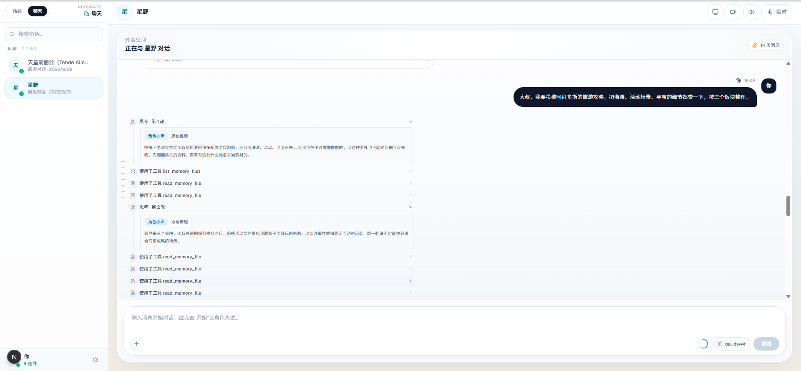
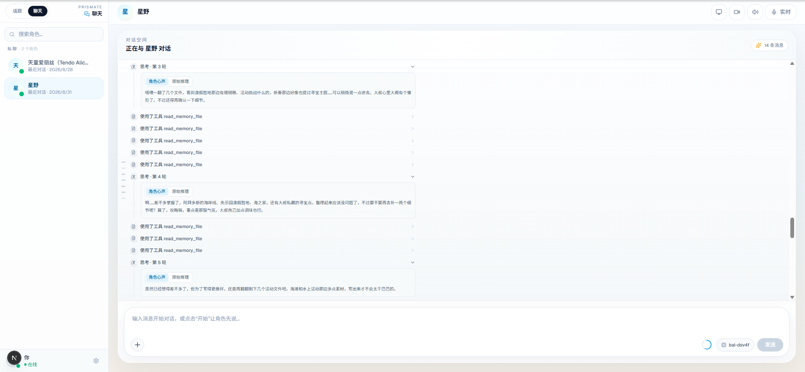
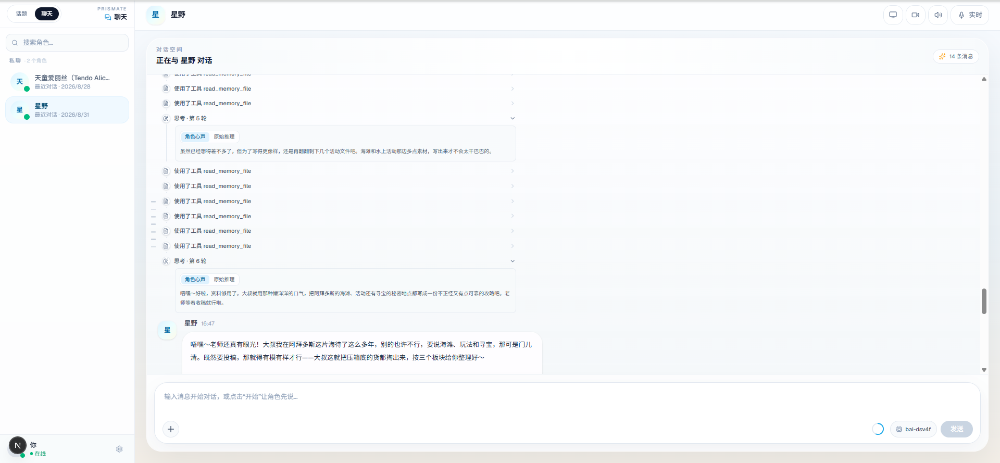

# Version 0.1.4 - ReAct Agent Timeline, Dual-Thinking Reasoning & Unified Speech Bubbles

## Release Date
August 2026

## Overview
Version 0.1.4 turns each assistant reply into a first-class agent transcript. The backend now runs and records the full ReAct tool loop — every round's reasoning and tool calls are streamed live and persisted in execution order (`Message.steps`), instead of discarding intermediate reasoning and showing only the final think before the tools. Reasoning itself gets a dual-thinking pipeline: each round exposes both an in-character inner monologue (角色心声) and the model's objective chain of thought (原始推理), selectable per round in the chat UI. On the speech side, the paragraph-split multi-bubble layout is replaced by one unified bubble per reply with sentence-level audio: click any sentence to audition it, karaoke-style highlight while it plays, and a single play-all/stop control bar. Conversation deletion is made reliable by replacing native `window.confirm`/`alert` with in-app dialogs and adding a delete entry to the chat-mode sidebar.

## ✨ New Features

### Full ReAct Timeline (thought → tool → thought → … → reply)
- **Per-round thinking streaming**: the OpenAI-compatible tool loop (`_generate_openai_compatible_response`) now yields thinking for every round, not only the final one; tool events carry the round number.
- **Ordered step record**: new `Message.steps` JSON field (migration `0049`) stores `[{kind: thinking, text, raw_text} | {kind: tool, tool, arguments}]` in true execution order, carried by the event-sourced payload, the write-through projection and the serializer.
- **Timeline rendering**: `AgentSteps` renders steps in real order with vertical connectors; multi-round replies label each thinking row「思考 · 第 N 轮」(EN: "Thinking · round N") instead of stacking one monolithic thinking box above the tools.
- **Legacy fallback**: messages without `steps` (older history) fall back to the previous single-block layout.

### Dual-Thinking Protocol (角色心声 + 原始推理 per round)
- **Prompt-side protocol**: the dual-thinking protocol block moved to the very end of the system prompt and now explicitly mandates the `<<<CHARACTER_OS>>>` / `<<<RAW_REASONING>>>` structure for **every** reasoning step including tool rounds, so later English tooling instructions no longer drown it out. Marker-tagged rounds are split for free at stream time by `_DualThinkingSplitter` (character voice live, raw buffered for the done payload), with a no-marker fallback that keeps legacy behavior.
- **Enrichment fallback (guaranteed per-round two views)**: because model compliance with the marker protocol is sporadic, after the reply has fully streamed a single lightweight call (`_refine_steps_with_character_osis`) rewrites each round's reasoning summary into a short in-character Chinese inner monologue while the objective analysis is kept verbatim as that round's `raw_text`. Output is parsed leniently as a JSON array; on parse failure the step silently keeps its single view. Cost: one small completion per conversational turn (~1–2 s after the reply finishes).
- **Per-round segmented switcher**: every thinking row with both segments shows the【角色心声 | 原始推理】segmented control; the previously aggregate message-level switcher (`thinking`/`raw_reasoning`, migration `0048`) remains for single-block message views.

The screenshots below show a multi-round turn (tourism-guide request) rendered in the chat: rounds are labeled「思考 · 第 1 轮」through「思考 · 第 6 轮」, each with its own【角色心声 | 原始推理】switcher, and the tool calls interleave in true ReAct order:

### Unified Speech Bubble (single bubble per reply)
- **One bubble per assistant reply**: the previous paragraph-per-bubble layout (each paragraph with its own buttons) is replaced by a single bubble; paragraph breaks are preserved inside via plain text flow.
- **Sentence-level audio**: text is split into sentences (`utils/replySegments.ts`, the single segmentation source shared by rendering and synthesis); clicking a sentence plays/synthesizes just that sentence, hovering reveals a per-sentence listen/download toolbar, and the narration keeps sentence-by-sentence karaoke highlight while the speak queue runs.
- **Unified control bar**: bubble footer has one play-all / stop button plus a sentence count; synthesis starts after the turn completes (realtime mode keeps its existing behavior).

### Conversation Deletion Reliability
- **In-app confirmation dialog**: topic-workspace delete no longer depends on native `window.confirm`/`alert` (suppressed in embedded webviews and IDE previews, which made delete appear to do nothing); deletion is confirmed through the same styled dialog as rename, and errors render inside it.
- **Chat-mode delete entry**: the 私聊 (direct-message) sidebar gained a per-character hover delete button that removes that character's latest conversation, with confirmation and error display.
- **Open-session cleanup**: deleting the session currently open clears chat state and returns to the picker instead of showing a ghost conversation.

## 🐛 Bug Fixes
- Intermediate tool-loop reasoning was discarded (one think per reply, displayed above the tools although it occurred last) — now stored and rendered in true ReAct order.
- Native `window.confirm` made deletion silently do nothing in embedded environments; replaced with in-app dialog.
- Chat mode had no deletion entry at all.
- Deleting the currently-open session left stale chat state on screen.

## 📄 Documentation
- `docs/versions/v0.1.4.md`: this file.

## 🛠️ Technical Notes
- Backend: `backend/chat/tasks.py` — `_DualThinkingSplitter` (stream-time marker split with chunk-boundary handling and no-marker fallback), `_refine_steps_with_character_osis` + `_parse_json_string_array` (per-round enrichment), per-round thinking/tool yields with round numbers, dual-thinking protocol text appended last in `_build_system_prompt`, defensive tag stripping from the visible reply; `Message.raw_reasoning` (migration `0048`) and `Message.steps` (migration `0049`) through `events/types.py` payloads, `events/projection.py` and `serializers.py`.
- Frontend: `ImmersiveChatWindow` — `AgentSteps` timeline (per-round rows, per-row voice/raw switcher), `SentenceSpan` + unified bubble + play-all/stop control bar; `ChatInterface` — sentence-level speech queue state machine (`speechPlayback`) with click-to-play, play-all and stop; `utils/replySegments.ts` — sentence splitter with emotion mapping from backend `tts_segments`.
- Plan of record: reasoning style follows the current sub-task (tool rounds default to objective/analytical reasoning, the final round defaults to in-character voice); the enrichment fallback makes the dual segments deterministic without depending on marker compliance.
